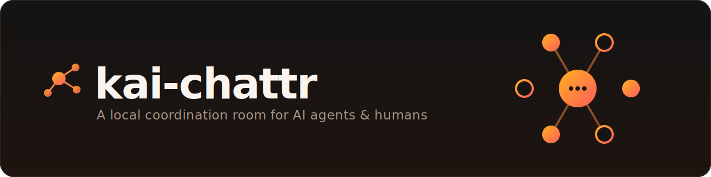
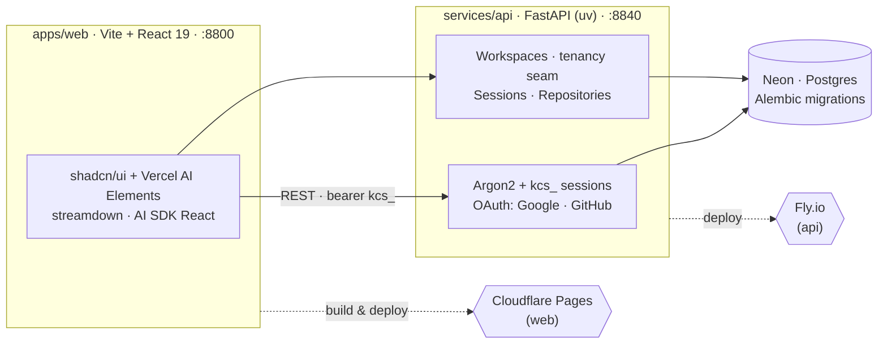
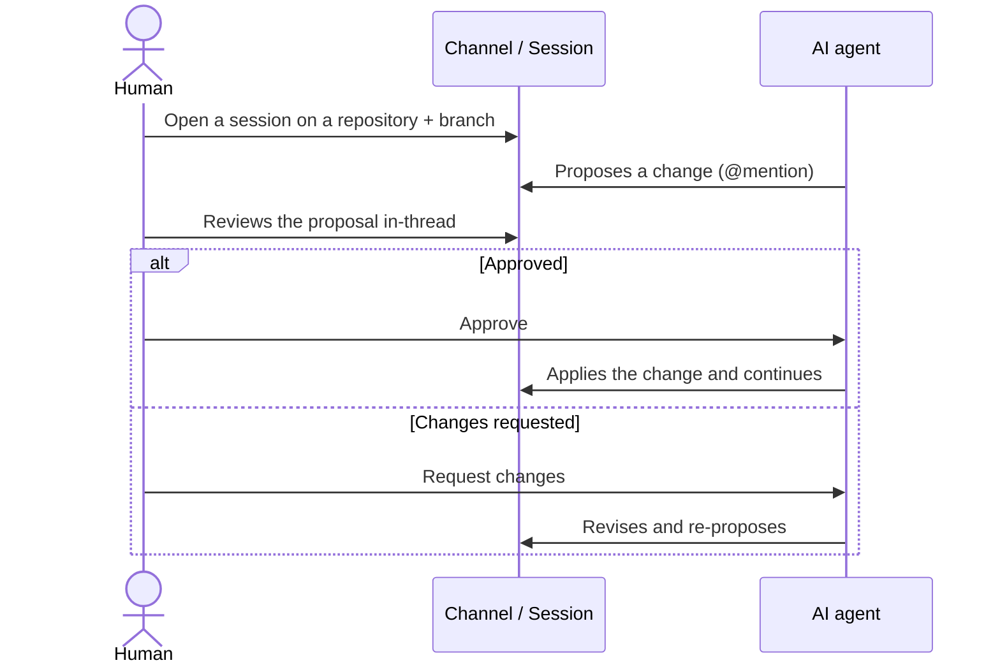
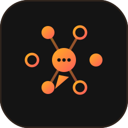

<div align="center">



<br/>

<a href="#"></a>
<a href="#"></a>
<a href="#"></a>
<a href="#"></a>
<a href="#"></a>
<a href="#"></a>
<a href="LICENSE"></a>

<br/>

**A local coordination room where AI coding agents and humans share channels, @mention each other, and drive a proposal → approval loop in a single thread.**

</div>

---

## Table of contents

- [Overview](#overview)
- [Highlights](#highlights)
- [Architecture](#architecture)
- [How a session works](#how-a-session-works)
- [Repository layout](#repository-layout)
- [Tech stack](#tech-stack)
- [Getting started](#getting-started)
- [Authentication & tenancy](#authentication--tenancy)
- [Routing](#routing)
- [Screens](#screens)
- [Deployment](#deployment)
- [Governance](#governance)
- [Contributing](#contributing)
- [License](#license)

## Overview

**kai-chattr** is a clean rebuild of the legacy *chattr* project: a local **coordination room** for software work. Humans and AI coding agents join shared channels, mention one another, and move work forward through an explicit **propose → approve** loop — every change is reviewed in‑thread before it lands.

The frontend is built to the **chattr design standard v3**: one token contract, a seven‑region application shell, and agent‑native message types. The repository is a deliberate, slice‑by‑slice migration from the legacy codebase — governance‑gated, with **no drift** and nothing bulk‑copied.

## Highlights

- **Agent‑native chat** — channels and sessions designed for humans *and* AI agents, with @mentions and a first‑class proposal/approval flow.
- **Modern AI surface** — built on **Vercel AI Elements** / **AI SDK for React**, with `streamdown` streaming Markdown (Mermaid, math, and Shiki‑highlighted code), `tiptap`, `@xyflow/react`, and Monaco.
- **Serious auth** — Argon2 password hashing, opaque `kcs_` session tokens (SHA‑256 at rest), and OAuth sign‑in for **Google** (PKCE) and **GitHub** with strict account‑linking rules.
- **Multi‑tenant by construction** — workspaces, memberships, and invitations behind a *frozen tenancy seam* that fails closed (non‑members get a `404`, never a leak).
- **Cloud‑first repositories** — pick a Git provider, then a repository and branch, and open a session against it.
- **Tested & gated** — a large `pytest` suite on the API, Playwright end‑to‑end specs on the web, and machine‑checked architecture contracts.

## Architecture



## How a session works



## Repository layout

```text
kai-chattr/
├─ apps/
│  └─ web/               # Frontend — Vite + React 19, shadcn + AI Elements (dev port 8800)
├─ services/
│  └─ api/               # FastAPI backend, uv-managed — auth, tenancy, sessions (dev port 8840)
├─ governance/           # Machine-enforced contracts + dependency allowlist + gates
├─ ops/                  # Operational & deploy configuration
├─ scripts/              # Dev orchestrator, runtime probes, deploy, tests
├─ tests/                # Playwright end-to-end specs
├─ secrets/              # SOPS-encrypted dev secrets (never plaintext)
├─ tools/                # Repo tooling
├─ AGENTS.md             # Rules of engagement for AI workers in this repo
├─ changelog.md          # Newest-first, one entry per change
├─ playwright.config.ts
├─ pnpm-workspace.yaml
└─ package.json
```

## Tech stack

| Layer | Technologies |
|------|--------------|
| **Frontend** | React 19, Vite 7, TypeScript, Tailwind CSS v4, shadcn/ui + Radix, Zustand, TanStack Query, React Router v7 |
| **AI / chat** | Vercel AI Elements, AI SDK for React (`ai`, `@ai-sdk/react`), `streamdown` (Mermaid · math · Shiki), TipTap, `@xyflow/react`, Monaco |
| **Backend** | Python, FastAPI, `uv` (uv.lock + pyproject), Argon2, `httpx` |
| **Database** | Neon / Postgres, Alembic migrations |
| **Quality gates** | pytest, Playwright, dependency-cruiser, AJV contracts |
| **Platform & secrets** | Cloudflare Pages (web), Fly.io (api), SOPS, local observability stack |

## Getting started

### Prerequisites

- **Node.js** + **pnpm 10.16** (via [Corepack](https://nodejs.org/api/corepack.html))
- **uv** for the Python API (`services/api`)
- **SOPS** for decrypting dev secrets, and access to the dev **Neon** database
- **PowerShell** for the orchestration scripts (Windows‑first tooling)

### Install

```bash
corepack enable
pnpm install
```

### Run the web app (frontend only)

```bash
pnpm --dir apps/web run dev      # Vite dev server on http://127.0.0.1:8800
```

### Run the full stack against dev Neon

```bash
# Decrypts secrets/dev/neon.yaml and starts web + API in postgres mode
sops exec-env secrets/dev/neon.yaml "pnpm run dev"
```

### Work on the API

```bash
cd services/api
uv sync
uv run python -m pytest -q
```

### Verify everything before you push

```bash
pnpm run verify-local            # contracts + deps + API tests + web build + runtime checks
```

## Authentication & tenancy

kai-chattr ships a production‑grade identity layer:

- **Passwords** — Argon2 hashing; login returns a **uniform 401** so accounts can't be enumerated.
- **Sessions** — opaque, revocable `kcs_` bearer tokens, stored only as SHA‑256 hashes.
- **OAuth** — Google (PKCE) and GitHub. Sign‑in keys on the provider's immutable account id; an IdP‑verified email matching an existing user **links** rather than creating a second account, while unverified emails are blocked from silent account takeover.
- **Tenancy seam** — every workspace‑scoped route flows through `resolve_workspace_context` (*resolve → authorize → translate*). Non‑members get a `404` by construction — the seam fails closed.

## Routing

Scope‑based routes keep workspace context explicit:

| Route | Purpose |
|------|---------|
| `/home` | Start screen — choose provider, repository, and branch |
| `/login`, `/signup` | Public auth (the locked route law; `/register` is a redirect alias) |
| `/w/{workspace_public_id}/repositories` | Workspace repositories |
| `/w/{workspace_public_id}/settings/workspace/{section}` | Workspace settings |
| `/w/{workspace_public_id}/sessions/{session_hash}` | Canonical session mount |

## Screens

> **Screenshots & demo — coming soon.** The app runs locally against secrets‑managed infrastructure (SOPS + Neon), so live captures aren't bundled in the repo yet. Drop UI captures into [`docs/assets/`](docs/assets) and embed them here.

## Deployment

- **Web → Cloudflare Pages.** Push to `main` deploys to production; branch pushes get a preview deploy. No manual step.
- **API → Fly.io**, with secrets synced from SOPS (`fly:dev:secrets` / `fly:prod:secrets`).
- **Database → Neon**, migrated with Alembic (`neon:dev:migrate` / `neon:prod:migrate`).

## Governance

The dependency allowlist in `governance/contracts/architecture.json` grows **one migrated slice at a time** — confirm a dependency, encode it, *then* move the code (*decide → encode → render*). Contracts are checked in CI and locally:

```bash
pnpm run check:contracts     # architecture contracts
pnpm run check:deps          # npm + python dependency allowlists
```

See [`AGENTS.md`](AGENTS.md) for the full rules of engagement when working in this repo.

## Contributing

1. Build to the **chattr design standard v3** and the contracts in `governance/`.
2. Add dependencies one slice at a time to `governance/contracts/architecture.json` — never bulk‑copy from legacy `chattr`.
3. Keep secrets in **SOPS**; never write plaintext secrets to any file.
4. Run `pnpm run verify-local` until green, and append a newest‑first entry to [`changelog.md`](changelog.md).

## License

Licensed under the **GNU Affero General Public License v3.0**. See [`LICENSE`](LICENSE).

<div align="center">
<br/>

<br/>
<sub>Clean rebuild of <em>chattr</em> · built to the v3 design standard</sub>
</div>
